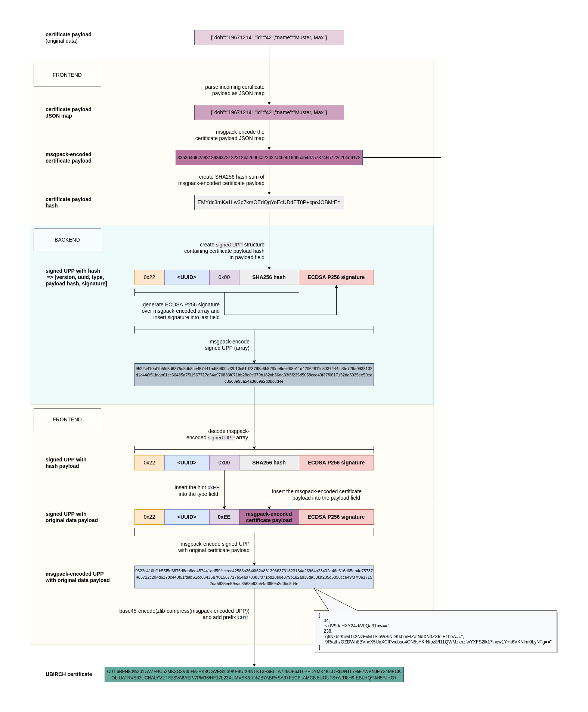

# ubirch-certification-js

JavaScript package to certify data in the UBIRCH system to be anchored by UBIRCH in a trustworthy way.
You can create UBIRCH Protocol Package (UPP) Certificates of the following types:

* SIGNED
* ~~CHAINED~~ (not yet implemented)
* ~~PLAIN~~ (not yet implemented)

The UbirchCertification package consists of two parts:

* **UbirchCertificationTools** - contains the core functionality of certifying data against the UBIRCH system
* **UbirchCertification** - contains convenient functions to create certificates of the different types from JSON or hashes.

GitHub repository:
[ubirch-certification-js Repository on GitHub](https://github.com/ubirch/ubirch-certification-js)

Documentation:
[https://developer.ubirch.com/ubirch-certification-js/](https://developer.ubirch.com/ubirch-certification-js/)

Reference implementation of UPP certificate creation and verification:
[ubirch-certificate-js-reference](https://github.com/ubirch/ubirch-certificate-js-reference)

For verification of UPP certificates you can use:
[ubirch-verification-js Repository on GitHub](https://github.com/ubirch/ubirch-verification-js)


## What's New?

* initial version 0.1.0: beta with first working creation of SIGNED UPPs

## Usage

### From NPM registry or YARN

Install package from npm

```
    npm i @ubirch/ubirch-certification-js
    // or using Yarn
    yarn add @ubirch/ubirch-certification-js
```

## Prerequisites

To be able to create UBIRCH UPP Certificates you need to contact the [UBIRCH support](support@ubirch.com) to get:
* a deviceId
* a verification token
* a client certificate

## Example Code

### Simple Certification Example with Script Tag Inclusion

```html
<!DOCTYPE html>
<html lang="en">
<head>
  <meta charset="UTF-8"/>
  <meta http-equiv="X-UA-Compatible" content="IE=edge"/>
  <meta name="viewport" content="width=device-width, initial-scale=1.0"/>
  <title>Simple Ubirch Certification</title>
</head>
<body>
<div id="form-area">
  <div class="section">
    <div class="input-field" style="padding: 10px;">
      <label for="simple-json-input">JSON:</label><br>
      <textarea rows="10" cols="80" placeholder="" type="text" id="simple-json-input">{"dob":"19671215","id":"44","name":"Muster, Max"}</textarea>
    </div>
    <button id="simple-start-certification">
      Test certification
    </button>
  </div>
  <div class="section">
    <div class="input-field" style="padding: 10px;">
      <label for="simple-signed-upp-output">signed UPP:</label><br>
      <textarea rows="10" cols="80" placeholder="" type="text" id="simple-signed-upp-output"></textarea>
    </div>
  </div>
</div>
<script src="https://cdnjs.cloudflare.com/ajax/libs/js-sha256/0.9.0/sha256.min.js"></script>
<script src="https://unpkg.com/@ubirch/ubirch-certification-js/dist/index.js"></script>
<script>
  const EUbirchCertificationStateKeys = {
    CERTIFICATION_PENDING: "CERTIFICATION_PENDING",
    CERTIFICATION_FAILED: "CERTIFICATION_FAILED",
    CERTIFICATION_SUCCESSFUL: "CERTIFICATION_SUCCESSFUL",
    CERTIFICATION_STATE_UNDEFINED: "CERTIFICATION_STATE_UNDEFINED"
  };

  let ubirchCertification;

  document.addEventListener("DOMContentLoaded", function () {
    // create UbirchCertification instance
    ubirchCertification = new window.UbirchCertification({
      deviceId: '<YOUR_DEVICE_UUID>',
      stage: '<USED_STAGE>'
    });
  });

  // test hash button click listener
  document.getElementById('simple-start-certification').addEventListener('click', function () {
    console.log('CLICK');
    if (ubirchCertification) {
      ubirchCertification.certifyJson(document.getElementById('simple-json-input').value)
        .then(resp => displayCertificationResult(resp));
    }
  });

  function displayCertificationResult(resp) {
    if (resp.certificationState === EUbirchCertificationStateKeys.CERTIFICATION_FAILED) {
      (document.getElementById('simple-signed-upp-output')).value =
        "#################### CERTIFICATION_FAILED #####################\n"  +
        resp.failed.code +
        resp.failed.message ? "\n" + resp.failed.message : '';
    } else {
      (document.getElementById('simple-signed-upp-output')).value = resp.upp.upp;
    }
  }
</script>
</body>
</html>
```

## API

### <code>UbirchCertification</code>

#### Import `UbirchCertification` and initialise

```ts
import { UbirchCertification } from '@ubirch/ubirch-certification-js';
```

#### `constructor(config: IUbirchCertificationConfig)`

Create instance of `UbirchCertification` class with config settings.

```ts
const ubirchVerification = new UbirchCertification({
  deviceId: '9b34bf6d-6c8a-4b5f-b787-decabfe6ba77',
  algorithm: 'sha512',
  state: 'demo',
  language: 'en'
});
```

##### config settings:


| Attribute               | Type     | Values                              | Default      | Description                                                                                                                                           |
|-------------------------|----------|-------------------------------------|--------------|-------------------------------------------------------------------------------------------------------------------------------------------------------|
| <code>deviceId</code>   | string   |                                     | **REQUIRED** | is a deviceId of a UBIRCH thing, used to create certificates. Please contact [UBIRCH support](support@ubirch.com) - they will provide you a deviceId. |
| <code>stage</code>      | String   | 'dev', 'demo', 'qa', 'prod'         | 'dev'        | optional param to set UBIRCH stage in which certificates are created                                                                                  |
| <code>uppType</code>    | String   | 'SIGNED', 'CHAINED', 'PLAIN' | 'SIGNED'     | optional param to set type of UPP; currently only SIGNED UPP creation is implemented         |
| <code>algorithm</code>  | String   | 'sha256', 'sha512'                  | 'sha256'     | hashing algorithm used during creation of your certificate                                                                                            |
| <code>language</code>   | String   | 'de', 'en'                          | 'en'         | optional param to set language of messages (e.g. error messages)                                                                                      |

#### Create Certificate from JSON data: `certifyJson(payload: any): Promise<IUbirchCertificationResult>`

Creates a UPP from provided JSON data.

The response will be a `Promise` in this structure:


```ts
export interface IUbirchCertificationResult {
  certificationState: 'CERTIFICATION_PENDING' | 'CERTIFICATION_SUCCESSFUL' | 'CERTIFICATION_FAILED' | 'CERTIFICATION_STATE_UNDEFINED';
  upp: {
    upp: string,
    type: 'SIGNED' | 'CHAINED' | 'PLAIN',
    state: 'created' | 'anchored'
  };
  failed?: {
    code: EError,
    errorBECodes?: string[];
    message?: string
  }
}
```
* `upp.upp` contains the upp as a string (e.g. a SIGNED UPP)
* `upp.type` contains the type of the upp (currently only SIGNED is implemented)
* `failed` is an optional parameter that will be present if an error occurred, containing error codes indicating which error has happened and probably an error message.
  * a list of all error codes is provided [here](error-codes.md)

#### Subscribe to Messenger: get messenger(): Observable<UbirchMessage>

You can subscribe to the `messenger` Observable to get informed about:

* the currently performed step(s)
* errors that have occurred
* certification results

```ts
if (!subscription) subscription = ubirchCertification.messenger.subscribe((msg) => {
    console.log(msg);
    (document.getElementById('log') as HTMLInputElement).value += JSON.stringify(msg, null, 2) + '\n\n';
});
```

### <code>UbirchCertificationTools</code>

The `UbirchSertification` uses the `UbirchCertificationTools` for the separate steps of creating a UPP of the given type.
You can also access these steps separately.

#### Creation of a SIGNED UPP

The following steps need to be done for a SIGNED UPP:

```
         const originalPayload = UbirchCertificationTools.getMsgPackPayload(json);
         const hash = UbirchCertificationTools.getHashedPayload(originalPayload);

         const resultObj = await this.callSignedCertification(hash);

         const upp: Buffer = UbirchCertificationTools.extractSignedUpp(resultObj);
         const uppWithMsgPackPayload: Uint8Array = UbirchCertificationTools.replaceHashByMsgPackInUpp(upp, originalPayload);
         const signedUpp: string = UbirchCertificationTools.packSignedUpp(uppWithMsgPackPayload);
```

With the function `callSignedCertification` that calls the certify endpoint:

```
  private async callSignedCertification (hash): Promise<IUbirchSignedCertificationResponse> {
    const verificationUrl = 'https://api.certify.<STAGE>.ubirch.com/api/v1/x509/anchor';

    const options = {
      method: 'POST',
      body: hash,
      headers: {
        'Content-type': 'text/plain',
        'X-UPP-Type-Id': 'signed',
        'X-Identity-Id':this.deviceId
      }
    };

    return fetch(verificationUrl, options)
      .catch((err) => err.message as string)
      .then((response) => {

        switch (response.status) {
          case 200: {
            return response.json();
          }
          default: {
            self.handleError(EError.ANY_ERROR);
          }
        }
      });
  }
```




## Copyright

```fundamental
Copyright (c) 2022 ubirch GmbH

Licensed under the Apache License, Version 2.0 (the "License");
you may not use this file except in compliance with the License.
You may obtain a copy of the License at

    http://www.apache.org/licenses/LICENSE-2.0

Unless required by applicable law or agreed to in writing, software
distributed under the License is distributed on an "AS IS" BASIS,
WITHOUT WARRANTIES OR CONDITIONS OF ANY KIND, either express or implied.
See the License for the specific language governing permissions and
limitations under the License.
```
